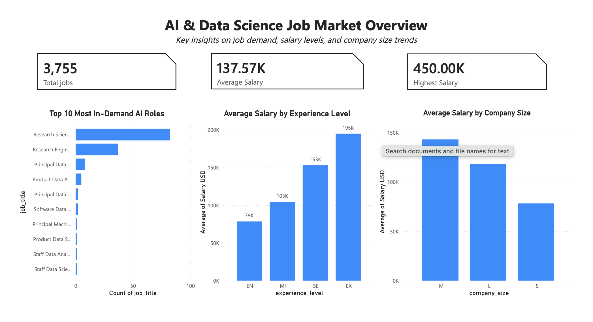
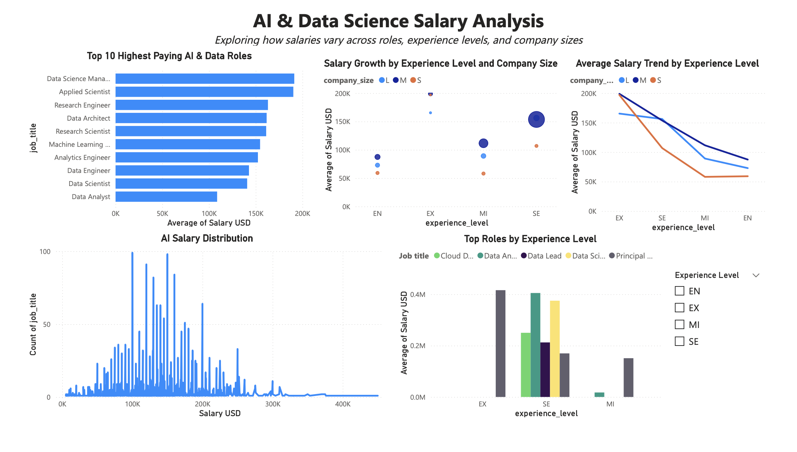
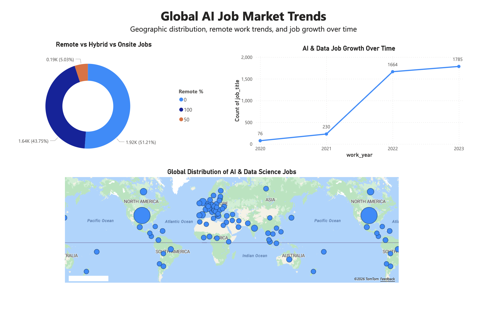

# AI & Data Science Job Market Dashboard

Power BI analysis of real-world AI, ML, and Data Science salary data, focused on compensation, experience level, remote work, company size, job role, and geography.

## Why this dataset

The project uses a real-world salary dataset derived from anonymous salary submissions collected by **aijobs.net** from professionals working in AI, Machine Learning, Data Science, and related fields. The underlying salary data is published openly for salary research and career-market analysis.

**Original data source:** aijobs.net Global AI/ML/Data Science Salary Index  
**Source repository:** https://github.com/foorilla/ai-jobs-net-salaries  
**License:** CC0 / Public Domain

The version used in this dashboard contains **3,755 salary records** covering 2020–2023.

## Business questions explored

- Which AI and Data Science roles have the highest reported salaries?
- How does compensation vary by experience level?
- How do remote, hybrid, and on-site work arrangements compare?
- How does company size relate to reported salary?
- Which countries appear most frequently in the dataset?
- How did reported salaries and role distribution change over time?

## Dashboard Pages

### 1. Job Market Overview
Overview of total records, average salary, role demand, and compensation by experience level.

### 2. Salary Insights
Analysis of salary distribution, top-paying roles, company size, and experience-level compensation.

### 3. Global Trends
Analysis of employee/company geography, remote-work distribution, and changes across work years.

## Tools & Skills

- Power BI
- Data Cleaning & Transformation
- Data Analysis
- Data Visualization
- Dashboard Development
- Business Intelligence

## Dataset fields

The dataset includes:

- `work_year`
- `experience_level`
- `employment_type`
- `job_title`
- `salary`
- `salary_currency`
- `salary_in_usd`
- `employee_residence`
- `remote_ratio`
- `company_location`
- `company_size`

## Dashboard Preview

### Job Market Overview

### Salary Analysis

### Global Job Market Trends

## Data note

Salary submissions are anonymous and self-reported, so the dashboard should be interpreted as analysis of the available survey records rather than a complete representation of the entire global labor market.
